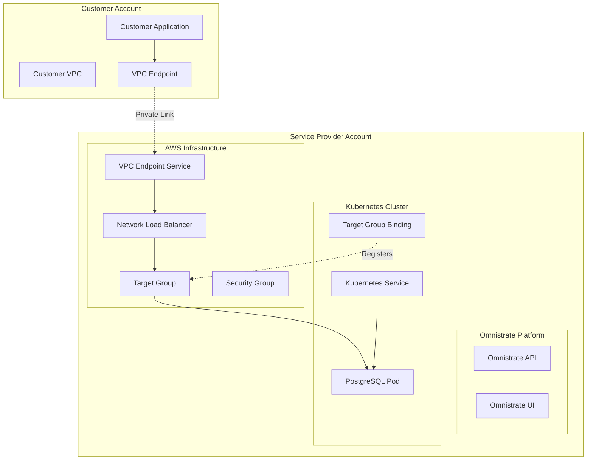

# Architecture Deep Dive

This document provides a comprehensive architectural overview of the Private Link PostgreSQL example, explaining how all components work together to deliver a secure, scalable database-as-a-service solution.

## Overall Architecture

The Private Link PostgreSQL example implements a sophisticated multi-layered architecture that leverages AWS Private Link technology to provide secure, private connectivity between service providers and customers.



## Component Architecture

### 1. AWS Private Link Layer

#### VPC Endpoint Service

The VPC Endpoint Service is the cornerstone of the private connectivity:

**Purpose**: Enables customers to create private endpoints in their VPCs that connect directly to your PostgreSQL service without internet exposure.

**Key Features**:
- **Auto-acceptance**: Endpoint connections are automatically approved
- **Cross-account Access**: Secure connections from customer accounts
- **Principal-based Access**: Only specified AWS accounts can connect
- **DNS Resolution**: Automatic DNS name generation

**Configuration**:
```terraform
resource "aws_vpc_endpoint_service" "pg_vpc_endpoint_service" {
  acceptance_required         = false
  network_load_balancer_arns  = [aws_lb.ps_lb.arn]
  allowed_principals          = ["arn:aws:iam::{{ $var.connectAccountID }}:root"]
}
```

#### Network Load Balancer (NLB)

**Purpose**: Provides high-performance, low-latency load balancing for PostgreSQL traffic.

**Architecture Choices**:
- **Layer 4 (TCP)**: Optimal for database connections
- **Cross-zone Load Balancing**: Ensures high availability across AZs
- **Private Subnets**: Enhanced security by avoiding public exposure
- **Multiple AZ Deployment**: Fault tolerance and availability

**Key Benefits**:
- Ultra-low latency (preserves source IP)
- High throughput capability
- Automatic failover between healthy targets
- Integration with VPC Endpoint Services

### 2. Kubernetes Integration Layer

#### Target Group Binding

The Target Group Binding is a Kubernetes custom resource that bridges AWS load balancers with Kubernetes services:

**Purpose**: Automatically registers PostgreSQL pods as targets in the AWS load balancer target group.

**How it Works**:
1. Watches Kubernetes service endpoints
2. Automatically registers/deregisters pod IPs
3. Performs health checks on target pods
4. Maintains target group membership

```yaml
apiVersion: elbv2.k8s.aws/v1beta1
kind: TargetGroupBinding
metadata:
  name: postgres-targetgroup-binding
spec:
  serviceRef:
    name: helm-postgresql
    port: 5432
  targetGroupARN: "{{ $terraform.out.target_group_arn }}"
```

#### Pod Scheduling Architecture

**Exclusive Scheduling**: Uses pod anti-affinity to ensure only one PostgreSQL pod per node:

```yaml
podAntiAffinity:
  requiredDuringSchedulingIgnoredDuringExecution:
    - labelSelector:
        matchExpressions:
          - key: omnistrate.com/schedule-mode
            operator: In
            values:
              - exclusive
      topologyKey: kubernetes.io/hostname
```

**Node Affinity**: Ensures pods are scheduled on appropriate nodes:
- Omnistrate-managed nodes only
- Correct region and instance type
- Proper resource allocation

### 3. Security Architecture

#### Network Security

**Multi-layered Security Approach**:

1. **VPC-level Isolation**:
   - Services deployed in private subnets
   - No direct internet access
   - VPC peering or Private Link only

2. **Security Group Rules**:
   ```terraform
   ingress {
     from_port   = 5432
     to_port     = 5432
     protocol    = "tcp"
     cidr_blocks = ["{{ $sys.deploymentCell.cidrRange }}"]
   }
   ```

3. **Application-level Security**:
   - PostgreSQL authentication and authorization
   - SSL/TLS encryption for data in transit
   - Database-level access controls

#### Identity and Access Management

**AWS IAM Integration**:
- Service-specific IAM roles
- Least privilege access principles
- Cross-account trust relationships
- Terraform execution roles

**Principal-based Access Control**:
```terraform
allowed_principals = ["arn:aws:iam::{{ $var.connectAccountID }}:root"]
```

### 4. Data Flow Architecture

#### Connection Establishment Flow

1. **Customer Initiates Connection**:
   - Customer creates VPC endpoint in their account
   - Specifies the VPC Endpoint Service name
   - Configures DNS resolution

2. **Private Link Routing**:
   - AWS routes traffic through backbone network
   - No internet traversal
   - Maintains source IP information

3. **Load Balancer Processing**:
   - NLB receives connection on port 5432
   - Performs health checks on targets
   - Routes to healthy PostgreSQL pod

4. **Database Connection**:
   - Pod receives connection request
   - PostgreSQL authenticates user
   - Establishes database session

#### Health Check Architecture

**Multi-level Health Checking**:

1. **AWS Target Group Health Checks**:
   ```terraform
   health_check {
     port                = "traffic-port"
     protocol            = "TCP"
     interval            = 30
     healthy_threshold   = 3
     unhealthy_threshold = 3
   }
   ```

2. **Kubernetes Liveness Probes**:
   - PostgreSQL process monitoring
   - Database connectivity checks
   - Resource availability validation

3. **Application-level Monitoring**:
   - Query performance metrics
   - Connection pool status
   - Database operation health

## Scalability Architecture

### Horizontal Scaling

**Load Balancer Scaling**:
- Network Load Balancer automatically scales
- Cross-zone load balancing distributes traffic
- Multiple target registration for redundancy

**Pod Scaling**:
- Kubernetes Horizontal Pod Autoscaler support
- Automatic target group registration
- Dynamic endpoint updates

### Vertical Scaling

**Instance Type Flexibility**:
- Configurable EC2 instance types
- Resource limit adjustments
- Performance optimization options

**Storage Scaling**:
- Persistent volume expansion
- Storage class optimization
- Backup and recovery scaling

## High Availability Architecture

### Multi-AZ Deployment

**Availability Zone Distribution**:
```terraform
subnets = [
  "{{ $sys.deploymentCell.privateSubnetIDs[0].id }}",
  "{{ $sys.deploymentCell.privateSubnetIDs[1].id }}",
  "{{ $sys.deploymentCell.privateSubnetIDs[2].id }}"
]
```

**Fault Tolerance Design**:
- Load balancer spans multiple AZs
- PostgreSQL pods can be scheduled across AZs
- Automatic failover mechanisms

### Disaster Recovery

**Backup Architecture**:
- Automated PostgreSQL backups
- Point-in-time recovery capability
- Cross-region backup replication options

**Recovery Procedures**:
- Automated health detection
- Pod restart mechanisms
- Data recovery workflows

## Performance Architecture

### Connection Optimization

**TCP-level Optimization**:
- Network Load Balancer preserves connections
- No SSL termination at load balancer
- Direct TCP passthrough

**Database Performance**:
- Connection pooling support
- Query optimization features
- Index management capabilities

### Resource Allocation

**CPU and Memory Management**:
```yaml
resources:
  requests:
    cpu: 100m
    memory: 128Mi
  limits:
    cpu: 150m
    memory: 256Mi
```

**Disk I/O Optimization**:
- SSD-backed storage
- Optimized volume types
- Performance monitoring

## Monitoring Architecture

### Infrastructure Monitoring

**AWS CloudWatch Integration**:
- Load balancer metrics
- Target group health metrics
- VPC endpoint service metrics

**Kubernetes Monitoring**:
- Pod resource utilization
- Service endpoint health
- Cluster-level metrics

### Application Monitoring

**PostgreSQL Metrics**:
- Connection count and duration
- Query performance statistics
- Database size and growth

**Custom Metrics**:
- Application-specific monitoring
- Business metric tracking
- SLA compliance monitoring

## Security Considerations

### Data Protection

**Encryption Architecture**:
- TLS encryption for data in transit
- PostgreSQL SSL configuration
- Certificate management

**Access Control**:
- Database user management
- Role-based access control
- Audit logging capabilities

### Network Security

**Isolation Mechanisms**:
- VPC-level network isolation
- Security group restrictions
- Private subnet deployment

**Compliance Features**:
- Network traffic logging
- Access audit trails
- Security policy enforcement

## Integration Patterns

### Multi-Service Architecture

**Service Dependencies**:
1. Terraform service creates infrastructure
2. Helm service deploys database
3. Private PostgreSQL service configures endpoints

**Parameter Passing**:
```yaml
parameterDependencyMap:
  terraform: connectAccountID
  helm: username
```

### Extension Points

**Customization Opportunities**:
- Custom PostgreSQL configurations
- Additional security rules
- Monitoring and alerting extensions
- Backup and recovery enhancements

## Future Architecture Considerations

### Advanced Features

**Read Replica Support**:
- Multiple read-only instances
- Geographic distribution
- Load balancing between replicas

**Connection Pooling**:
- PgBouncer integration
- Connection management optimization
- Scalability improvements

**Advanced Monitoring**:
- Real-time performance metrics
- Predictive scaling
- Automated optimization

This architecture provides a robust foundation for building secure, scalable, and highly available database-as-a-service solutions using AWS Private Link technology with the Omnistrate platform.
