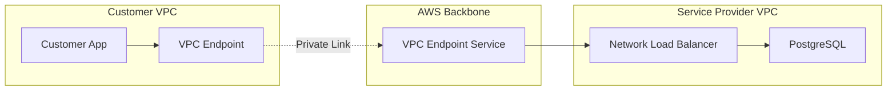

# Security Guide

This document provides comprehensive security guidelines and best practices for the Private Link PostgreSQL example deployment.

## Security Architecture Overview

The Private Link PostgreSQL example implements multiple layers of security to protect data and infrastructure:

- **Network Isolation**: Traffic never traverses the public internet
- **Access Control**: Identity-based and network-based access controls
- **Encryption**: Data encryption in transit and at rest
- **Audit and Monitoring**: Comprehensive logging and monitoring
- **Principal-based Authorization**: Fine-grained AWS IAM integration

## Network Security

### Private Link Security Benefits

**Traffic Isolation**:

- All traffic flows through AWS backbone network
- No exposure to internet threats
- VPC-to-VPC private connectivity
- Source IP preservation for audit trails

**Architecture Security**:



### VPC Security Configuration

**Security Group Rules**:

The example implements restrictive security group rules:

```terraform
resource "aws_security_group" "nlb_sg" {
  name        = "nlb-security-group"
  description = "Security group for NLB"
  vpc_id      = "{{ $sys.deploymentCell.cloudProviderNetworkID }}"

  ingress {
    from_port   = 5432
    to_port     = 5432
    protocol    = "tcp"
    cidr_blocks = ["{{ $sys.deploymentCell.cidrRange }}"]
  }

  egress {
    from_port   = 0
    to_port     = 0
    protocol    = "-1"
    cidr_blocks = ["0.0.0.0/0"]
  }
}
```

**Best Practices**:

1. **Minimal Port Exposure**: Only PostgreSQL port (5432) is exposed
2. **Source Restriction**: Traffic limited to deployment cell CIDR
3. **Egress Control**: Consider restricting egress to necessary destinations
4. **Regular Review**: Periodically audit security group rules

### Network Segmentation

**Private Subnet Deployment**:

```terraform
subnets = [
  "{{ $sys.deploymentCell.privateSubnetIDs[0].id }}",
  "{{ $sys.deploymentCell.privateSubnetIDs[1].id }}",
  "{{ $sys.deploymentCell.privateSubnetIDs[2].id }}"
]
```

**Segmentation Benefits**:

- No direct internet access
- Controlled routing through NAT gateways
- Network-level isolation from public resources
- Reduced attack surface

## Access Control and Authentication

### AWS IAM Integration

**Principal-based Access Control**:

```terraform
resource "aws_vpc_endpoint_service" "pg_vpc_endpoint_service" {
  acceptance_required         = false
  network_load_balancer_arns  = [aws_lb.ps_lb.arn]
  allowed_principals          = ["arn:aws:iam::{{ $var.connectAccountID }}:root"]
}
```

**IAM Best Practices**:

1. **Least Privilege**: Grant minimum necessary permissions
2. **Regular Rotation**: Rotate access keys and credentials regularly
3. **Cross-Account Trust**: Use IAM roles for cross-account access
4. **Audit Access**: Monitor IAM usage with CloudTrail

### Database Authentication

**PostgreSQL Security Configuration**:

```yaml
global:
  postgresql:
    auth:
      postgresPassword: "{{ $var.password }}"
      password: "{{ $var.password }}"
      username: "{{ $var.username }}"
      database: "postgres"
```

**Authentication Enhancements**:

1. **Strong Passwords**: Implement password complexity requirements
2. **User Management**: Create dedicated database users for applications
3. **Role-based Access**: Use PostgreSQL roles for permission management
4. **Connection Limits**: Set appropriate connection limits

### Kubernetes Security

**Pod Security Context**:

```yaml
securityContext:
  runAsNonRoot: true
  runAsUser: 999
  fsGroup: 999
  capabilities:
    drop:
      - ALL
```

**Network Policies**:

```yaml
apiVersion: networking.k8s.io/v1
kind: NetworkPolicy
metadata:
  name: postgres-network-policy
spec:
  podSelector:
    matchLabels:
      app: postgresql
  policyTypes:
  - Ingress
  - Egress
  ingress:
  - from:
    - podSelector:
        matchLabels:
          app: allowed-client
    ports:
    - protocol: TCP
      port: 5432
```

## Encryption and Data Protection

### Data in Transit

**SSL/TLS Configuration**:

Enable SSL for all PostgreSQL connections:

```yaml
primary:
  configuration: |
    ssl = on
    ssl_cert_file = '/etc/ssl/certs/server.crt'
    ssl_key_file = '/etc/ssl/private/server.key'
    ssl_ca_file = '/etc/ssl/certs/ca.crt'
```

**Client Connection Requirements**:

```bash
# Require SSL connections
psql "sslmode=require host=<endpoint> port=5432 user=<username> dbname=postgres"

# Verify SSL certificate
psql "sslmode=verify-full host=<endpoint> port=5432 user=<username> dbname=postgres"
```

### Certificate Management

**Certificate Best Practices**:

1. **Use Valid Certificates**: Avoid self-signed certificates in production
2. **Regular Rotation**: Implement automated certificate rotation
3. **Strong Ciphers**: Use modern TLS cipher suites
4. **Certificate Monitoring**: Monitor certificate expiration

### Data at Rest

**Storage Encryption**:

```yaml
primary:
  persistence:
    enabled: true
    storageClass: "encrypted-gp3"
    size: 10Gi
```

**Encryption Options**:

1. **EBS Encryption**: Enable encryption for persistent volumes
2. **Database-level Encryption**: Use PostgreSQL transparent data encryption
3. **Backup Encryption**: Encrypt database backups
4. **Key Management**: Use AWS KMS for key management

## Secret Management

### Kubernetes Secrets

**Password Management**:

```yaml
apiVersion: v1
kind: Secret
metadata:
  name: postgres-credentials
type: Opaque
data:
  username: <base64-encoded-username>
  password: <base64-encoded-password>
```

**Secret Best Practices**:

1. **External Secret Management**: Use AWS Secrets Manager or HashiCorp Vault
2. **Rotation**: Implement automated secret rotation
3. **Access Control**: Limit secret access to necessary pods
4. **Encryption**: Use encrypted storage for secrets

### Environment Variable Security

**Secure Configuration**:

```yaml
env:
  - name: POSTGRES_PASSWORD
    valueFrom:
      secretKeyRef:
        name: postgres-credentials
        key: password
  - name: POSTGRES_USER
    valueFrom:
      secretKeyRef:
        name: postgres-credentials
        key: username
```

## Monitoring and Auditing

### Security Monitoring

**CloudTrail Integration**:

Enable comprehensive API logging:

```json
{
  "Trail": {
    "Name": "omnistrate-security-trail",
    "S3BucketName": "security-audit-logs",
    "IncludeGlobalServiceEvents": true,
    "IsMultiRegionTrail": true,
    "EnableLogFileValidation": true
  }
}
```

**VPC Flow Logs**:

```terraform
resource "aws_flow_log" "security_flow_log" {
  iam_role_arn    = aws_iam_role.flow_log.arn
  log_destination = aws_cloudwatch_log_group.security.arn
  traffic_type    = "ALL"
  vpc_id          = data.aws_vpc.main.id
}
```

### Database Security Monitoring

**PostgreSQL Audit Logging**:

```sql
-- Enable audit logging
ALTER SYSTEM SET log_statement = 'all';
ALTER SYSTEM SET log_connections = on;
ALTER SYSTEM SET log_disconnections = on;
ALTER SYSTEM SET log_line_prefix = '%t [%p]: [%l-1] user=%u,db=%d,app=%a,client=%h ';
```

**Monitoring Queries**:

```sql
-- Monitor failed login attempts
SELECT * FROM pg_stat_activity WHERE state = 'idle in transaction (aborted)';

-- Check connection counts
SELECT usename, count(*) FROM pg_stat_activity GROUP BY usename;

-- Monitor long-running queries
SELECT pid, now() - pg_stat_activity.query_start AS duration, query 
FROM pg_stat_activity 
WHERE (now() - pg_stat_activity.query_start) > interval '5 minutes';
```

## Compliance and Governance

### Regulatory Compliance

**SOC 2 Compliance**:

1. **Access Controls**: Implement role-based access controls
2. **Audit Logging**: Comprehensive audit trail maintenance
3. **Data Protection**: Encryption and secure data handling
4. **Monitoring**: Continuous security monitoring

**GDPR Compliance**:

1. **Data Minimization**: Store only necessary data
2. **Data Portability**: Enable data export capabilities
3. **Right to Erasure**: Implement data deletion procedures
4. **Privacy by Design**: Built-in privacy protections

### Security Policies

**Password Policy**:

```sql
-- Implement password complexity
CREATE EXTENSION IF NOT EXISTS pgcrypto;

-- Password validation function
CREATE OR REPLACE FUNCTION validate_password(password text) 
RETURNS boolean AS $$
BEGIN
  -- Minimum length
  IF length(password) < 12 THEN
    RETURN false;
  END IF;
  
  -- Complexity requirements
  IF NOT (password ~ '[A-Z]' AND password ~ '[a-z]' AND password ~ '[0-9]' AND password ~ '[^A-Za-z0-9]') THEN
    RETURN false;
  END IF;
  
  RETURN true;
END;
$$ LANGUAGE plpgsql;
```

## Incident Response

### Security Incident Procedures

**Detection and Response Flow**:

1. **Automated Detection**: CloudWatch alarms and monitoring
2. **Alert Notification**: Immediate notification of security events
3. **Incident Assessment**: Rapid evaluation of security impact
4. **Containment**: Isolate affected systems
5. **Investigation**: Forensic analysis and root cause determination
6. **Recovery**: Restore secure operations
7. **Lessons Learned**: Update security procedures

### Breach Response Plan

**Immediate Actions**:

1. **Isolate Systems**: Disconnect affected resources
2. **Preserve Evidence**: Capture logs and system state
3. **Notify Stakeholders**: Alert relevant parties
4. **Document Actions**: Maintain incident timeline

**Recovery Procedures**:

1. **Vulnerability Remediation**: Fix security weaknesses
2. **System Hardening**: Implement additional security measures
3. **Credential Rotation**: Change all potentially compromised credentials
4. **Security Testing**: Validate security improvements

## Security Best Practices Checklist

### Pre-Deployment Security

- [ ] Review and approve all security group rules
- [ ] Verify SSL/TLS configuration
- [ ] Validate IAM role permissions
- [ ] Test access controls
- [ ] Enable audit logging
- [ ] Configure monitoring alerts

### Post-Deployment Security

- [ ] Monitor security metrics regularly
- [ ] Perform security assessments
- [ ] Update security configurations
- [ ] Review access logs
- [ ] Test incident response procedures
- [ ] Maintain security documentation

### Ongoing Security Maintenance

- [ ] Regular security updates
- [ ] Credential rotation
- [ ] Access review and cleanup
- [ ] Security training for team members
- [ ] Compliance audits
- [ ] Penetration testing

## Security Configuration Examples

### Enhanced Security Configuration

```yaml
# Enhanced PostgreSQL security configuration
primary:
  configuration: |
    # SSL Configuration
    ssl = on
    ssl_ciphers = 'ECDHE+AESGCM:ECDHE+CHACHA20:ECDHE+AES256:ECDHE+AES128:!aNULL:!SHA1'
    ssl_prefer_server_ciphers = on
    
    # Connection Security
    tcp_keepalives_idle = 600
    tcp_keepalives_interval = 30
    tcp_keepalives_count = 3
    
    # Audit Logging
    log_statement = 'ddl'
    log_min_duration_statement = 1000
    log_connections = on
    log_disconnections = on
    log_hostname = on
    
    # Security Settings
    shared_preload_libraries = 'pg_stat_statements'
    track_activities = on
    track_counts = on
```

This security guide provides a foundation for secure deployment and operation of the Private Link PostgreSQL example. Regular security reviews and updates are essential for maintaining a strong security posture.
